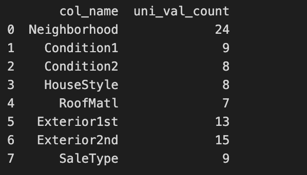

# House_Price_Prediction_using_Meta_Modelling
________________________________________________________________________

### Why Meta Modeling?
________________________________________________________________________

The use of meta-modeling, particularly stacking or ensemble methods, involves combining the predictions of multiple base models to create a more robust and potentially higher-performing model.

- Improve Generalization:
Meta-modeling can help improve the generalization performance of overall model. By combining predictions from different base models, the ensemble model may capture a broader range of patterns in the data, reducing overfitting and enhancing performance on new, unseen data. __Let's see if we will are getting better results with High dimensionality data__.

- Reduction of Model Bias and Variance:
Different base models may have varying strengths and weaknesses. Combining them can help mitigate biases and reduce the overall variance of the model. This is especially beneficial when individual models may be sensitive to specific aspects of the data.

- Automatic Model Selection:
In stacking, the meta-model learns to weigh the predictions of individual base models, effectively performing a form of automatic model selection. This can be particularly useful when dealing with a diverse set of models with different strengths.

- Increased Model Stability:
Meta-modeling can increase the stability of predictions by reducing the impact of outliers or noise in individual base models. The ensemble model tends to be more resilient to extreme predictions from any single model.
________________________________________________________________________

### Dataset Description:
________________________________________________________________________

_The dataset__ goal is to predict the house price (Regression Analysis).

The train data file contains 1022 rows with 81 columns (features). This high number of features presents significant challenges for machine learning modeling. This situation, known as high dimensionality, can lead to several issues that compromise the accuracy and gist of the data. The key problems associated with high dimensionality include __overfitting__, __increased training time__ and __resource consumption__, __sparsity issues__, and __lack of data knowledge__.

### Target Variable:
__Sale Price__: The price of house (continuous values).

__Dataset Source Link__: [https://www.kaggle.com/competitions/home-data-for-ml-course/data]

________________________________________________________________________

### Exploratory Data Analysis:
________________________________________________________________________

- __Data Analysis__
Duplicate Values: None
Shape: (1022, 82)
Features: 43 Categorical Features, 39 Numerical Features
Target Variable: Out of 1022 total counts of SalePrice, it has a mean of roughly $181,123, a standard deviation of $81,000, a minimum value of $35,311, and a maximum value of $755,000. The graphical representation of the spread, which clearly shows as skewed right:

           

-  __Categorical Features Analysis__:
    - __Missing Values__:
    

     
    

    Above Missing Value Table shows column which has missing values, number of unique count and null value count, total number of missing values per column and percentage of missing values. Overall, There are 4 columns having more than 50% null values and 11 columns having missing values more than 0.5%. As a result, Dropped __PoolQC__ , __MiscFeature__, __Alley__, __Fence__ features and apply imputation techniques on the remaining columns.

    - __Imputation and Significance__:
      - ###### Mode Imputation: 
      For categorical features, mode imputation has gained prominent use due to its effectiveness in minimizing bias and skewness, particularly when the proportion of missing values falls within the range of 0% to 10%. Consequently, due to the majority of our data exhibiting missing value percentages below 10%, mode imputation serves as the preferred method for addressing these missing values.
      
      

      
      

      It can be observed that there is not much difference after and before imputation. 

      - ###### Significance:
       
       Let's verify, whether the imputation method applied will change the significance or not? 
       
       As, The insights and significance must remains same even after imputations. The Chi_square contigency test was implemented to evaluate the significance of variables in relation to the target variable, both before and after imputation. 

       

       
       

       After Implementation, It can be concluded that mode imputation stands as a reliable method, as the result shows consistent level of significance between the feature variables and the 'Sale Price' variable.

    - __Unique Values per Feature__:
       

        
        

        There are 7 Features which has more than 5 unique values. These Features has many unique values which are unevenly spreaded. Hence, It can affect while converting into non-categorical features. With one hot encoding it can increase number of feature column which encourage high-dimensionality issues in the data. However, There are some columns which has high significance and correlation with the target variable, features like Neighborhood , SaleType and many others. Hence, Removing these features might not help.

- __Numerical Feature Analysis__:
    - __Sparsed Data__:
    

    
    

    There are 17 columns which has more than half sparsed values. This sparsity can increase sensitivity to noise and mean sqaured error might not be well-suited for sparse data, as they can be overly sensitive to the presence of zero values.

    - __Correlation__:    
    In Non Categorical Features, It can be said that 'GarageArea'-'GarageCars', '1stFlrSF'-'TotalBsmtSF','TotRmsAbvGrd'-'GrLivArea','GarageYrBlt'-'YearBuilt' are highly correlated features. Hence, Dropping those which are less correleated to the Saleprice for above absorved pairs. Those are ['GarageArea', '1stFlrSF', 'GarageYrBlt','TotRmsAbvGrd']. For now, only Dropping Garage Year Built as it has high correlation with YearRemodAdd amd Yearbuilt as compare to SalePrice (Target Variable). 

    On top it, Implemented Pearson Correlation Test to get correlation before and after Imputation. The mean and KNN Imputation had similar results with before Imputations.

   - __Missing Values__:
    

    
    

   There are 2 columns which has missing values. For numerical missing values, mean, median , mode and KNN Imputer are mostly implemented.

   - __Missing Value Imputation__:
    

    
    

    

    
    

   Both Simple Mean Imputation and KNN Imputation are viable methods for handling missing values without significantly altering the data's underlying statistics or distribution. Given the simplicity of Simple Mean Imputation and the relatively small size of the dataset, it is considered the most suitable approach for this particular scenario. This eliminates the need for more intricate imputation techniques.

________________________________________________________________________

### Feature Selection:
________________________________________________________________________

- __categorical Features__:
  
  - Statistical Test Results:
  First, a chi-square function was performed to analyze the association between the target variable ‘SalePrice’ and each categorical column both before and after handling missing values. The results separate the features into “significant” and “less significant” based on a significance level of 0.05.

  Secondly, The Pearson Correlation between the coefficients between the target column and the discrete features. Each feature is iterated through and correlations are based on a threshold of 0.25, identifying significant correlations above this threshold and less significant correlations below it. The threshold is kept low as outliers are highly sensitive with pearson test.

  - Using ML Model for Feature Importance:
  Modeling was performed using two different methods: Random Forest Regressor and Lasso Regression. Random Forest Regressor was performed for categorical data and Lasso Regression was performed for numerical data.
  Applied, Recursive Feature Elimination (RFE) pipeline with Random Forest and Lasso, the most relevant features were identified and selected based on their significance in predicting the target variable.

  Features Selected on the basis of common features obtained from Statistical Test and Modelling Analysis:
  

  
  

________________________________________________________________________

### Cluster into k many subgroups:
________________________________________________________________________

- __KMeans Clustering__:
After performing EDA and Feature Engineering, the train data was clustered into k subgroups. The data was encoded using an ordinal encoder and normalized using a Min-Max scaler to obtain k subgroups. The K value was verified using elbow method and silhouette score. 

The Elbow Method was used for determining the optimal number of clusters (k) in KMeans clustering by plotting the inertia (within-cluster sum of squares) against various values of k. Obtained k values by visualizing the inertia values against the number of clusters to identify the point where the inertia starts to decrease more slowly, indicating the optimal number of clusters where the Elbow occurs.

Elbow Curve, shows that 2 or 3 can be the K values.

To confirm the results of the elbow method, silhouette analysis was done to determine the optimal number of clusters (k) for KMeans clustering on the given dataset. A range of k values (from 2 to 5) was iterated through to compute silhouette scores for each clustering configuration.

For each value of k, a silhouette plot was generated showing the silhouette coefficients for each sample and their clusters, highlighting the silhouette score's average value with a red dashed line. It is very clear from the below image, k with value 3 has widely and at most evenly spread clusters around the dataset. K with value 2 has unevely spreaded thickness.

Now the each group value were segrated using K-values and classified into different group. The trained classifier based on the K optimal value was validated using grid-search cv. The group performed hyperparameter tuning for a Random Forest Classifier using grid-search cv. First, the dataset was split into training and validation sets, and then a grid of hyperparameters was defined to search through, including the number of estimators, maximum depth of trees, and criteria for node splitting. The grid-search cv evaluated various combinations of these hyperparameters using 5-fold cross-validation on the training set, selecting the best-performing set of hyperparameters based on accuracy.

The Shape of Group 1 is (381, 36), Group 2 is (309, 36), Group 3 is (332, 36) after validating using grid-search cv.

- __Stacking Method Modeling__:

For Each Group created above, 4 Regression Models will applied and extract the best fit model on the basis of 'Mean_Squared_Error' and 'Mean_Absolute_Error'

   __Meta Modeling using Stacking Generalization Technique__

__The Advantages of Meta Modeling:__
    - Higher Model prediction Accuracy
    - Faster, Cheaper training process
    - Build more generalized model: learn to solve many task at a time.

The optimal model choice varies across each subgroups, leading to distinct prediction errors in the stacking regressor. Gradient Boosting excels for Group 1, while Random Forest Regressor emerges as the superior choice for Groups 2 and 3. 

Evaluating model performance across datasets reveals further comparisions:

   - Training Data: Gradient Boosting stands out with an MSE of 1,548,129.8 and an MAE of 3,194.16, indicating a strong fit to the training data.
   
   

   - Test Data: Random Forest claims the top spot, demonstrating MSE scores between 15,116,734.4 and 1.911566e+08, and MAE scores ranging from 5,071.71 to 8,169.39. This suggests its superior ability to generalize to unseen data.

   

It's important to try different models with different sets of data to find the best one for the particular dataset.

- Conclusion 

   - Comparison of MSE:
   The MSE for the test data with the Random Forest Regressor is significantly higher (1.911566e+08) compared to the MSE for the train data with the Gradient Boosting Regressor (1.548129e+07). Higher MSE indicates a larger amount of error in predictions.

   - Comparison of MAE:
   The MAE for the test data with the Random Forest Regressor is higher (8169.399771) compared to the MAE for the train data with the Gradient Boosting Regressor (3194.639900). Higher MAE implies a higher average absolute error in predictions.

   - Overfitting:
   The significant difference between the train and test performance of the Random Forest Regressor suggests a potential issue with overfitting. Overfitting occurs when a model learns the training data too well, capturing noise in the data rather than the underlying patterns. It might be due to sparsed data.

   - Generalization:
   The key goal in machine learning is to build models that generalize well to new, unseen data. The Gradient Boosting Regressor's lower errors on both train and test data suggest better generalization compared to the Random Forest Regressor.